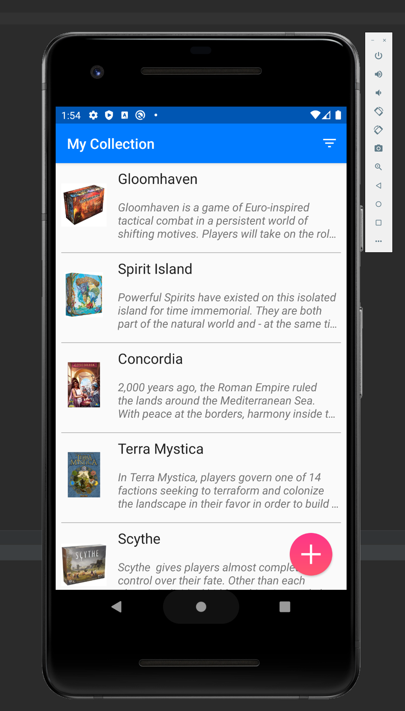
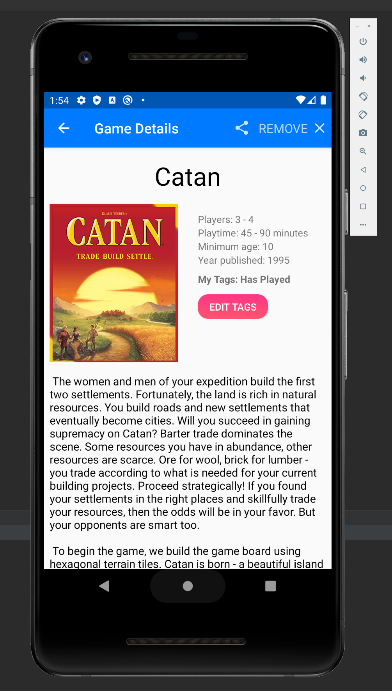
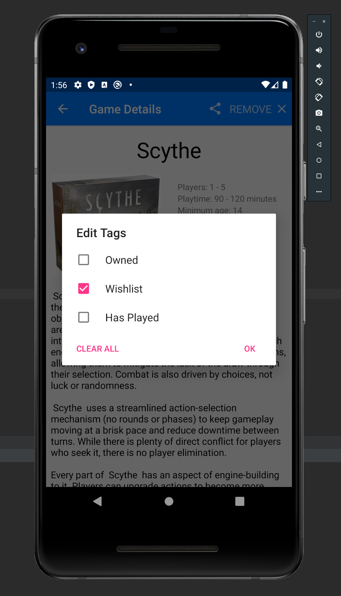
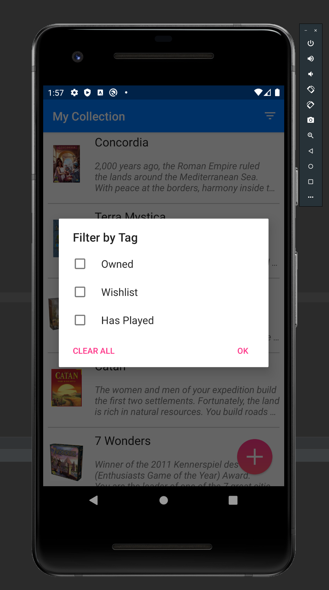

# Android Application: BoardGamez
By Carson Pemble, Terri Hewitt, and Tim O'Rourke


## About The Project
#### High-Level Description 
My team has created an application that our users could use as a board game collection manager. Our app allows users to keep track of the games that they own, want to own, or have played by using a tagging system. Our app uses the BoardGameGeek API to create a list of games, called a collection, that the user wants or has. Users can also view detailed information about games in their collection as well as get search results returned from BoardGameGeek. In addition, the board game manager app has a barcode scanning feature which can be used to scan the barcodes of games the user already owns. This allows for a simple way to add thier own board games into the collection management system. 

#### 3rd-Party APIs
The 3rd-party API my team used to retrieve information about board games is: https://boardgamegeek.com/wiki/page/BGG_XML_API&redirectedfrom=XML_API#. 
In our app, the user can search for board games by name. We first pass the name of the board game to the search API. For example, if a user searched for “Settlers of Catan”, the API query would look like: 
```sh
https://www.boardgamegeek.com/xmlapi/search?search=Settlers%20of%20Catan.
```

<br/>
This particular query produces a list of board games containing these search terms. 
From this list, we get the name of each board game and the year it was published to display to the user. 
We also store the id of each board game listed. 
When the user finds and selects a board game from that list to view additional details about, we use the board game id to obtain more specific information by running another query such as:
https://www.boardgamegeek.com/xmlapi/boardgame/32270?stats=1.
In this example, 32270 is the board game id and stats is set to true to obtain rating and ownership/trading information. 
From the results of this query we can obtain all the important information that we need. <br/>

For our barcode scanner, we used the free version of the BarcodeSpider API: https://devapi.barcodespider.com/. 
After scanning the barcode, we obtained the UPC and query the API to find the game title, description, and image: 
```sh
https://api.barcodespider.com/v1/lookup?token=<my_api_token>&upc=729220051097. 
```
The game title is then used to query for additional information on the boardgamegeek API. 
If the game is found on the boardgamegeek API, then that information will be used. 
However, if the game is not found on the boardgamegeek API, only the basic info will be given to the user.


## App Layout
#### Main Screen 
This the main activity for when you open the app. Here you can see a list of all the games that you have saved with a little bit of information about each of them. The brief description is where you can see the tags you marked each game with. You can even filter the list based on those tags. But if you want more information about the game you can click on it and it will lead you to the “Game Detail (In Collection)” screen. You will also notice that on the Main Screen in the lower right corner there is the option to add more games to your list. This button will lead you to the “Search” screen. 

#### Game Detail (In Collection) 
This activity shows a larger image of the board game along with a lot of other specific information about the game such as the following: Number of players, Play time, Age group, Rating, and a much longer description of the game. This page will also include the tags that the user has assigned to this game. At the bottom of this page there will be an edit button to edit the tags that the user gave this game; this will lead you to the “Tag Menu” screen. 

#### Game Detail (From Search)
This activity is very similar to the previous one for obvious reasons. The main difference is that instead of an “edit” button there will be an “add” button so that you can add the game to your “Main Screen” list. This screen also has a share button in the top right, if the user would like to share this game’s details with a friend of someone. If the user does choose to add the game to their list then our app will lead them back to the “Main Screen” to show them that their new game has in fact been added to the list. 

#### Tag Menu 
This is more of a pop-up, rather than an activity, but it is key to our app, so we included a visual representation of it. This is where the user can see the tags currently attached to the game and can add/remove tags. This pop-up will also have a save button and a cancel button for closing the pop-up. 

NOTE: This project uses the Android Vision API, https://github.com/googlesamples/android-vision, licensed under Apache-2.0, and is not intended for sale or redistribution. 


## Screenshots
#### Personal Game Collection Screen <br/>


#### Game Details Screen <br/>


#### Games can be given tags for organization <br/>


#### Filtering only games with specific tags <br/>



## Contributing
Contributions are what make the open source community such an amazing place to be learn, inspire, and create. Any contributions you make are **greatly appreciated**.
1. Fork the Project
2. Create your Feature Branch (`git checkout -b feature/AmazingFeature`)
3. Commit your Changes (`git commit -m 'Add some AmazingFeature'`)
4. Push to the Branch (`git push origin feature/AmazingFeature`)
5. Open a Pull Request


## Contact 
Carson Pemble - [LinkedIn](https://www.linkedin.com/in/carson-pemble/) - pemblec@oregonstate.edu - pemblec.github.io
Porfolio Link: [https://pemblec.github.io/](https://pemblec.github.io/)

